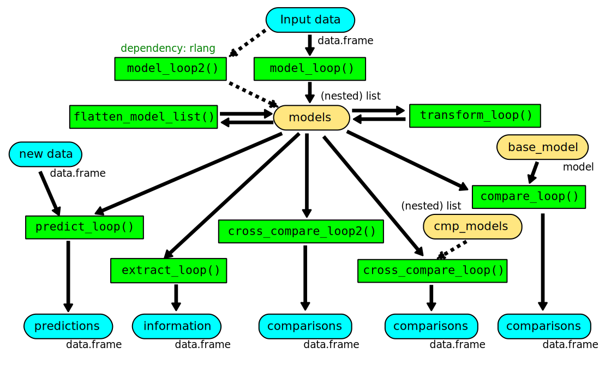

# r-model-loop

Tools to create list of models based on subsetting a given data.frame by given categories, as well as tools to analyze the resulting (possibly nested) list. 

## Motivation

One advantage of the R ecosystem is the ease at which a regression model can be produced from raw data and subsequent inference can be made based on the model. However, in some circumstances, it is useful to subset a large dataset by various criteria and produce a collection of relatively simple models, rather then producing a single complex model from the whole single dataset.

The purpose of this repo is to provide a set of tools that make it easy to produce a collection of subsetted models from a single dataset, and to make inference based on the resulting models.  

## Typical workflow

The tools provided in this repo is organized as a collection of R functions. All functions are defined within a single `model_loop.r` file, which can be loaded into the global environment via `source()` in base R.

The typical workflow in using these functions are as follows:

Basically, start by using `model_loop()` to process the input data into a (possibly nested) list of models. If needed, the models can then be transformed and/or reorganized using `flatten_model_list()` and `transform_loop()`. The resulting model list can then be used as input for `extract_loop()`, `predict_loop()`, `compare_loop()`, `cross_compare_loop()` and `cross_compare_loop2()`. All these 5 functions take the list of models (and sometimes additional data and/or model object(s)) and produce dataframes as output, and all such dataframes include information about the categories used to subset the data.
